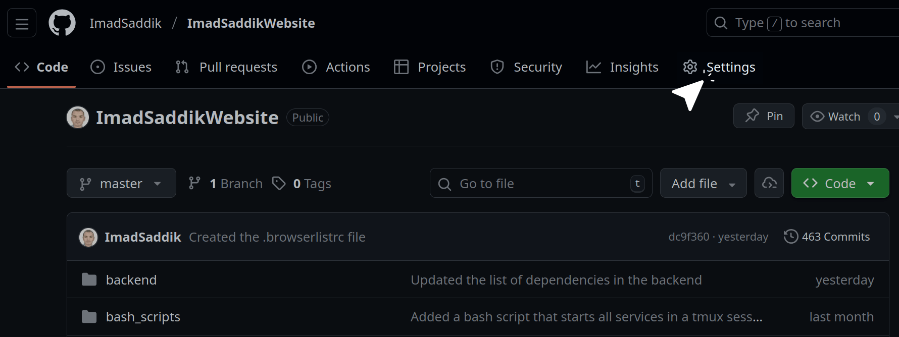
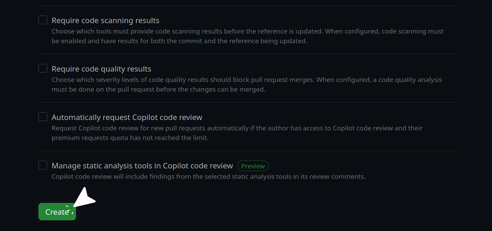

### Protect the default branch

Since you will be pushing code from your `main` or `master` branch, you should set up branch protection. This is an important practice to prevent broken code from making its way into production by mistake.

If your repository is public, you can secure a branch on GitHub for free. To begin, open your repository and click the **Settings** tab.


_Click the **Settings** tab in your GitHub repository._

Look for the "Code and automation" section in the left sidebar and click **Branches**.


_Click the **Branches** option under the **Code and automation** section._

Click **Add branch ruleset**. This feature allows you to define safety rules for your important branches. It controls how code is merged, ensuring you cannot accidentally delete the branch or push unreviewed code.


_Click the **Add branch ruleset** button._

Give your ruleset a descriptive name like `Main branch protection` and set the **Enforcement status** to **Active**. Under the **Target branches** section, click **Add target** and select **Include default branch**. This ensures the rules apply specifically to your `main` or `master` branch.


_Give your ruleset a name, activate it, and select the default branch as the target._

In the **Branch rules** section, enable the following settings:

- **Restrict deletions**: Prevents anyone (including you) from accidentally deleting the `main` branch.
- **Block force pushes**: Disables `git push --force`. This is critical, as force pushing rewrites history and can permanently erase past commits.
- **Require a pull request before merging**: Set the **Required approvals** to `0`.

> [!NOTE]
> Setting required approvals to `0` is a good strategy for solo developers. It forces you to open a pull request, which builds a great habit and documents your project history, but it lets you merge it yourself immediately without waiting for a second person to approve it. If you are working on a team, you would set this to 1 or 2.

Click the **Create** button to save your ruleset.


_Select the essential protection rules and click **Create**._

To test if the ruleset is active, try to push a commit directly to your main branch from your terminal. You should get a rejection error from GitHub that looks something like this:

```text
remote: error: GH013: Repository rule violations found for refs/heads/master.
remote:
remote: - Changes must be made through a pull request.
remote:
To https://github.com/ImadSaddik/ImadSaddikWebsite.git
! [remote rejected] master -> master (push declined due to repository rule violations)
error: failed to push some refs to 'https://github.com/ImadSaddik/ImadSaddikWebsite.git'
```

This means your lock is working perfectly. From now on, you will create a new branch for your features, commit your work there, and open a pull request to merge it into the main branch.