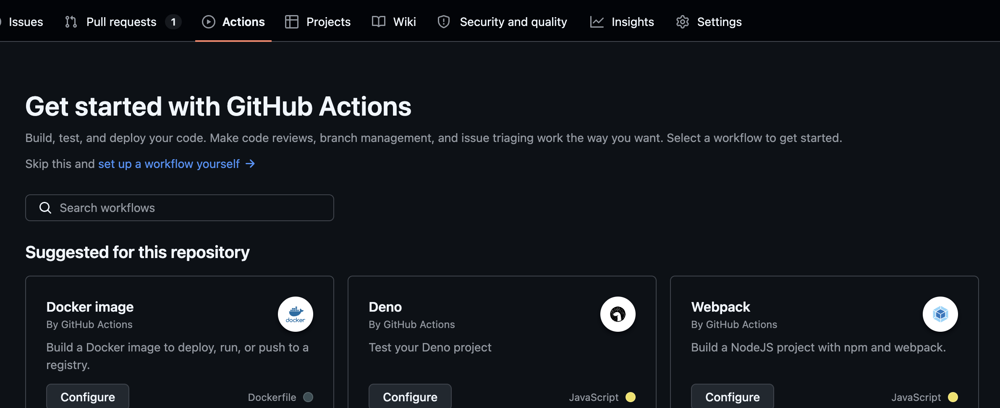
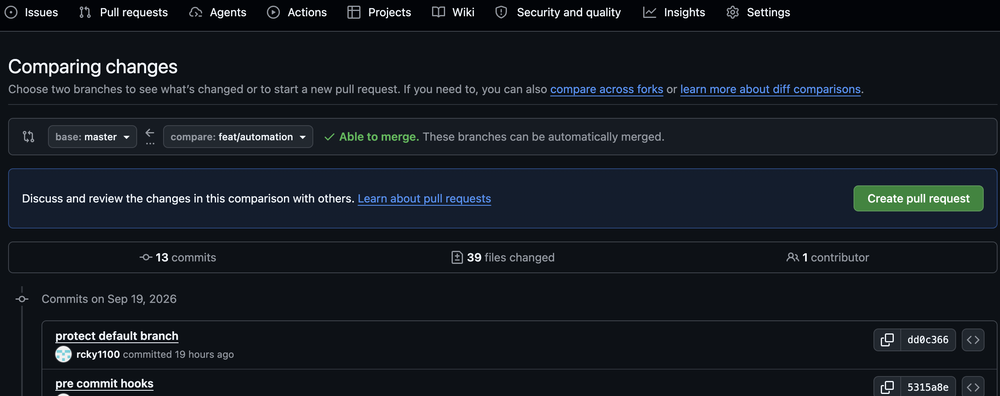
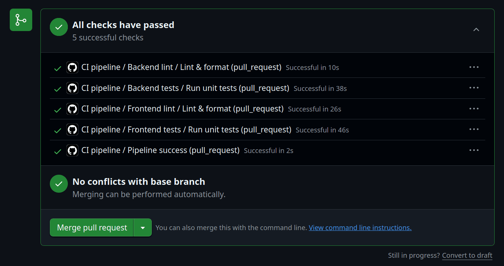
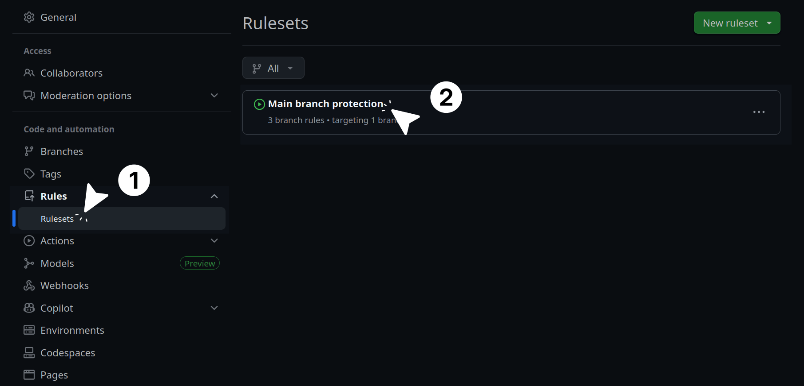
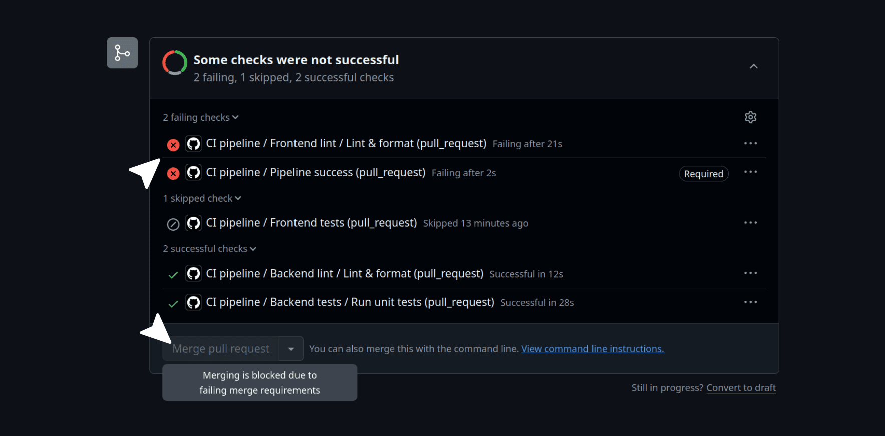

## Continuous integration & unit tests

### Introduction

In the previous subchapter, you locked down your local workflow. You set up branch protection and pre-commit hooks to catch formatting issues and simple bugs before they even leave your computer.

However, local checks have a limitation. They only run on your specific machine. If a teammate bypasses the hooks, or if your laptop has a different software version than your production server, broken code can still make its way into your repository.

[Continuous Integration (CI)](https://en.wikipedia.org/wiki/Continuous_integration) solves this problem. A CI pipeline automatically spins up a fresh, isolated computer in the cloud every time you push code. It downloads your repository, installs the exact dependencies required, and runs your quality checks from scratch. If any check fails, the pipeline blocks the pull request and prevents the bad code from merging into your master branch.

In this subchapter and the upcoming ones, you will learn how to implement these CI workflows using [GitHub Actions](https://github.com/features/actions).

### Building a modular architecture

Before writing the pipeline, we need to design a solid structure.

Many developers make the mistake of putting their entire CI/CD process into one massive file. When a step fails in a giant file, finding the exact error in the logs is frustrating.

Instead, you will use [reusable workflows](https://docs.github.com/en/actions/how-tos/reuse-automations/reuse-workflows). GitHub Actions allows you to write small, focused configuration files that handle one specific job (like linting the frontend). You can then use the `workflow_call` trigger to allow a main orchestrator file to call these smaller files when needed.

This keeps your code organized, makes your logs highly readable, and allows you to easily plug new jobs into your pipeline later.

### Linting and formatting in the cloud

First, you will mirror the same checks you configured in your local pre-commit hooks. This guarantees that the cloud environment holds your code to the same strict standards as your local machine.

#### The frontend workflow

Create a new file at `.github/workflows/frontend-lint-format-check.yml` and paste the following configuration:

```yaml
name: Frontend lint & format

on:
  workflow_call:

jobs:
  lint-format:
    name: Lint & format
    runs-on: ubuntu-latest
    defaults:
      run:
        working-directory: ./frontend
    steps:
      - name: Check out repository
        uses: actions/checkout@v4

      - name: Set up Node.js
        uses: actions/setup-node@v4
        with:
          node-version: "22"
          cache: "npm"
          cache-dependency-path: frontend/package-lock.json

      - name: Install dependencies
        run: npm ci

      - name: Run ESLint
        run: npm run lint

      - name: Check Prettier formatting
        run: npm run format:check
```

If you have never written a GitHub Actions workflow before, the syntax might look a bit unfamiliar. Let's break down the anatomy of this file so you understand exactly what it is doing.

```yaml
name: Frontend lint & format
```

This is the name of the workflow. It will appear in your GitHub repository's Actions tab, and it will be displayed in the logs when this workflow runs.

```yaml
on:
  workflow_call:
```

This tells GitHub that this file is a reusable template, not a standalone script. It will sit quietly until your main CI pipeline explicitly calls it to run.

```yaml
jobs:
  lint-format:
    name: Lint & format
```

This defines a job named `lint-format`. A workflow can have multiple jobs, and each job can run on a different machine with different configurations. By giving it a descriptive name, you can easily identify it in the logs.

```yaml
runs-on: ubuntu-latest
defaults:
  run:
    working-directory: ./frontend
```

GitHub spins up a fresh, isolated Linux machine (`ubuntu-latest`) just for this job. The `defaults` block tells the server to automatically run all subsequent commands inside the `./frontend` directory. This saves you from having to type `cd frontend` before every single step.

```yaml
steps:
  - name: Check out repository
  - name: Set up Node.js
  - name: Install dependencies
  - name: Run ESLint
  - name: Check Prettier formatting
```

A job is a series of steps. Each step is a single task that contributes to the overall job. The steps are executed in order, and if any step fails, the entire job fails.

```yaml
- name: Check out repository
  uses: actions/checkout@v4

- name: Install dependencies
  run: npm ci
```

Notice that we use two keywords in the `steps` list: `uses` and `run`.

- `uses`: This tells the server to execute a pre-built community script. Instead of writing custom code to download your repository, you use the official `actions/checkout@v4` action. We also use community actions to safely install `Node.js`.
- `run`: This acts exactly like typing a command into your own terminal.

```yaml
- name: Set up Node.js
  uses: actions/setup-node@v4
  with:
    node-version: "22"
    cache: "npm"
    cache-dependency-path: frontend/package-lock.json
```

Notice the caching configuration inside the Node.js setup block. By telling GitHub to cache `npm`, the runner saves a hidden copy of your downloaded packages.

On future runs, it will reuse those packages instead of downloading them from scratch over the internet. This significantly cuts your pipeline execution time.

#### The backend workflow

Next, create the backend equivalent at `.github/workflows/backend-lint-format-check.yml`:

```yaml
name: Backend lint & format

on:
  workflow_call:

jobs:
  lint-format:
    name: Lint & format
    runs-on: ubuntu-latest
    defaults:
      run:
        working-directory: ./backend
    steps:
      - name: Check out repository
        uses: actions/checkout@v4

      - name: Set up Node.js
        uses: actions/setup-node@v4
        with:
          node-version: "22"
          cache: "npm"
          cache-dependency-path: backend/package-lock.json

      - name: Install dependencies
        run: npm ci

      - name: Run ESLint
        run: npm run lint

      - name: Check Prettier formatting
        run: npm run format:check
```

Because you already understand the anatomy of a workflow, reading this file is straightforward. It uses the same structure as the frontend.

### Running unit tests

When you add tests to a CI pipeline, you can treat them like a black box. GitHub Actions does not care if you use Vitest, Jest, or Pytest. It only cares about the final exit code.

When the runner executes your test command, your testing framework reports back to the operating system. If every test passes, it returns a `0` (Success). If a single test fails, it returns a `1` (Error), which instantly stops the pipeline and prevents the broken code from merging.

> [!NOTE]
> This book will not teach you how to write unit tests for your specific application. Our focus is strictly on the infrastructure and the deployment pipeline. You only need to know how to plug your testing suite into the orchestrator.

#### The frontend workflow

Create a new file at `.github/workflows/frontend-unit-tests.yml` and paste the following configuration:

```yaml
name: Frontend unit tests

on:
  workflow_call:

jobs:
  tests:
    name: Run unit tests
    runs-on: ubuntu-latest
    defaults:
      run:
        working-directory: ./frontend
    steps:
      - name: Check out repository
        uses: actions/checkout@v4

      - name: Set up Node.js
        uses: actions/setup-node@v4
        with:
          node-version: "22"
          cache: "npm"
          cache-dependency-path: frontend/package-lock.json

      - name: Install dependencies
        run: npm ci

      - name: Run unit tests
        run: npm run test
```

This workflow checks out the code, sets up the Node.js environment with `npm` caching, and installs your dependencies.

The only new step is the final command: `run: npm run test`. This executes the testing script defined in your `package.json` file. If the tests pass, GitHub Actions moves on to the next job in your pipeline. If they fail, the pipeline stops immediately.

#### The backend workflow

Create the backend equivalent at `.github/workflows/backend-unit-tests.yml`:

```yaml
name: Backend unit tests

on:
  workflow_call:

# 1. Global env block: This applies to ALL jobs and ALL steps automaticall
env:
  NODE_ENV: test
  DB_HOST: localhost
  DB_USER: postgres
  DB_PASSWORD: test_password
  DB_NAME: test_db
  # Update these paths if your test environment looks for specific dummy files
  JWT_PRIVATE_KEY_PATH: ./keys/private.pem
  JWT_PUBLIC_KEY_PATH: ./keys/public.pem

jobs:
  tests:
    name: Run unit tests
    runs-on: ubuntu-latest
    defaults:
      run:
        working-directory: ./backend
    # 1. Spin up a live PostgreSQL container inside the runner
    services:
      postgres:
        image: postgres:15 # Change to your preferred version (e.g., 14, 16)
        env:
          POSTGRES_USER: postgres
          POSTGRES_PASSWORD: test_password
          POSTGRES_DB: test_db
        ports:
          - 5432:5432
        # Wait until Postgres is healthy and ready to accept connections
        options: >-
          --health-cmd pg_isready
          --health-interval 10s
          --health-timeout 5s
          --health-retries 5
    steps:
      - name: Check out repository
        uses: actions/checkout@v4

      - name: Set up Node.js
        uses: actions/setup-node@v4
        with:
          node-version: "22"
          cache: "npm"
          cache-dependency-path: backend/package-lock.json

      - name: Install dependencies
        run: npm ci

      # 3. Run your migration script to set up the database tables in ci environment
      - name: Run database migrations
        run: npm run migrate

      - name: Run unit tests
        run: npm run test
```

Like the frontend file, this workflow checks out the code, sets up Node.js with `npm` caching, and installs your dependencies.

The most important part is the final step: `run: npm run test`. This executes your Backend test suite. 

##### As integration test communicating with database, there is two approach for handle this
1. In-Memory Database (pg-mem, SQLite)
* **Blazing Fast Test Execution:** Because reading and writing data occurs completely inside volatile system RAM, tests complete in milliseconds. There are no slow disk read/write cycles.
* *Instant Infrastructure Startup:* There is no need to wait for a database to download, spin up, or pass health checks. The database exists the exact microsecond your test script starts.
* **Zero Host Requirements:** Anyone can run the test suite immediately upon cloning the project. Developers do not need to install Docker, PostgreSQL, or manage local port conflicts on their laptops.
**Isolated State per Test:** It is incredibly easy to reset, drop, or completely recreate a clean database state between individual test blocks because destroying it simply means clearing a JavaScript variable.

2. Real Docker Container (GitHub Services)
* **100% Production Parity:** You are testing against the actual, official PostgreSQL engine binaries. If a complex query, constraint, or indexing strategy works in your test container, it is guaranteed to work exactly the same way in production.
* **Full Native Feature Support:** Built-in simulation tools like pg-mem do not support 100% of advanced PostgreSQL features. A real container perfectly supports elements like triggers, stored procedures, complex aggregations, window functions, and specialized data types (such as JSONB or UUID).

* **Tests Your Real Migration Scripts:** Running a real container lets you run your actual npm run migrate workflow in CI exactly how it will execute on production deployment day. This helps catch broken SQL migration files before they reach live servers.

* **Accurate Performance & Concurrency Testing:** If you want to run integration tests that simulate multiple users hitting the database at the exact same time (concurrency checking), a real container handles connection pooling, row-locking, and query queues precisely like your production server.

Both npm run test and npm run migrate need environment variables that's why i created it global.

### The orchestrator

You now have four isolated, reusable workflows. It is time to tie them all together using a master file.

Create a file named `ci.yml` directly inside `.github/workflows/` (this is the file GitHub will monitor).

```yaml
name: CI pipeline

on:
  push:
    branches: [master]
  pull_request:
    branches: [master]
  workflow_dispatch:

jobs:
  frontend-lint-format-check:
    name: Frontend lint
    uses: ./.github/workflows/frontend-lint-format-check.yml

  backend-lint-format-check:
    name: Backend lint
    uses: ./.github/workflows/backend-lint-format-check.yml

  frontend-unit-tests:
    name: Frontend tests
    needs: frontend-lint-format-check
    uses: ./.github/workflows/frontend-unit-tests.yml

  backend-unit-tests:
    name: Backend tests
    needs: backend-lint-format-check
    uses: ./.github/workflows/backend-unit-tests.yml

  pipeline-success:
    name: Pipeline success
    needs:
      [
        frontend-lint-format-check,
        backend-lint-format-check,
        frontend-unit-tests,
        backend-unit-tests,
      ]
    runs-on: ubuntu-latest
    if: always()
    steps:
      - name: Pipeline succeeded
        if: "!contains(needs.*.result, 'failure') && !contains(needs.*.result, 'cancelled')"
        run: echo "All checks passed successfully!"
      - name: Pipeline failed
        if: contains(needs.*.result, 'failure') || contains(needs.*.result, 'cancelled')
        run: |
          echo "Some checks failed or were cancelled."
          exit 1
```

Let's break down how this master file orchestrates your pipeline.

```yaml
on:
  push:
    branches: [master]
  pull_request:
    branches: [master]
  workflow_dispatch:
```

This tells GitHub to run the pipeline automatically when you open a pull request against the `master` branch, or when code is successfully merged into it.

The `workflow_dispatch` line is a handy addition; it adds a manual "Run" button to the GitHub Actions interface so you can trigger the pipeline yourself if needed.

```yaml
frontend-lint-format-check:
  name: Frontend lint
  uses: ./.github/workflows/frontend-lint-format-check.yml
```

Instead of writing all the installation and testing steps here, you use the `uses` keyword to point to the local YAML files you created earlier. This keeps your orchestrator clean and easy to read.

```yaml
frontend-unit-tests:
  name: Frontend tests
  needs: frontend-lint-format-check
  uses: ./.github/workflows/frontend-unit-tests.yml
```

By default, GitHub Actions runs all jobs at the exact same time in parallel. The `needs` keyword forces an order of operations.

For example, `frontend-unit-tests` requires `frontend-lint-format-check` to pass first. If the linting step fails, the pipeline immediately cancels the testing step. This saves computing time and gives you faster feedback.

```yaml
pipeline-success:
  name: Pipeline success
  needs: [frontend-lint-format-check, backend-lint-format-check, frontend-unit-tests, backend-unit-tests]
  runs-on: ubuntu-latest
  if: always()
```

This is the most important part of the file. It acts as an aggregator for all the previous jobs. The `if: always()` command forces this final job to run even if the previous jobs crashed.

But how does it actually know if those previous jobs crashed? We check the `needs.*.result` variable, which contains the final status of every job listed in the `needs` array.

```yaml
steps:
  - name: Pipeline succeeded
    if: "!contains(needs.*.result, 'failure') && !contains(needs.*.result, 'cancelled')"
    run: echo "All checks passed successfully!"
  - name: Pipeline failed
    if: contains(needs.*.result, 'failure') || contains(needs.*.result, 'cancelled')
    run: |
      echo "Some checks failed or were cancelled."
      exit 1
```

Let's understand those GitHub Actions expressions:

- `needs.*.result`: The asterisk (`*`) is a wildcard. It grabs the final status (like `success`, `failure`, or `cancelled`) of every single job you listed in the `needs` array.
- `contains(...)`: This scans that list of results. If it finds a `failure` or a `cancelled` job anywhere in the list, the "Pipeline failed" step is triggered.
- `exit 1`: Tells the Linux machine to fail this step, which turns the final check mark red on your GitHub pull request. If it does not find any failures, it echoes the success message.

#### When you click on your repository actions button, it will look like below because right now we don't have any action workflow setup:



As default (main/master) branch is protected, so we can not direct push changes into this, so create a new branch like feat/automation and make sure to commit all these YAML files and push them to your repository before moving to the final step.

Now we have changes on github remote repo, but still Actions page will remain same, because workflow only appear when we create first Pull request for master as we set in CI files, 

### Seeing the pipeline in action

You have written a lot of YAML. Let's prove that this orchestration actually works.

Create a new branch, make a deliberate mistake in your code, and open a pull request against your `master` branch.


#### The failed pipeline

Because you pushed broken code, your linting or testing job will crash. Watch how the pipeline reacts:

It will show in same page where you clicked on Create pull request button at bottom, you can also move to actions page now and see all workflow there as well.


_The pipeline caught the error, but the merge button is still active._

This screenshot proves our logic works perfectly. Notice two things:

- The **Frontend tests** job was skipped entirely. Because it "needs" the linting job to pass first, GitHub saved computing time by stopping the branch early.
- The **Pipeline success** job saw that a previous step failed, so it intentionally triggered an error to clearly mark the whole run as a failure.

However, look closely at the bottom of the pull request. Even though the pipeline failed, the **Merge pull request** button is still active and clickable! This defeats the entire purpose of Continuous Integration. Right now, the pipeline is just giving you a suggestion; it is not actually protecting your code.

#### The successful pipeline


_When the code is fixed, all checks pass successfully._

Now that the code is clean, the pipeline passes. Let's fix that dangerous merge button so that the failed pipeline scenario can never happen again.

### Enforcing status checks on GitHub

Right now, your pipeline reports a green checkmark or a red cross, but you have to tell GitHub to actively block the pull request if that final check fails.

Go to your repository on GitHub and click on the **Settings** tab. In the left sidebar, click on **Rulesets**, then select the branch protection ruleset you created in Chapter 5.1.


_Navigate to your branch protection ruleset in the GitHub settings._

Scroll down to the **Branch rules** section and check the box that says **Require status checks to pass**.

Click the **Add checks** button and search for **Pipeline success**. Add it to the required list.


_Enable status checks and add the final pipeline success job as the mandatory requirement._

Click **Save changes** at the bottom of the page.

If you go back to a failed pull request now, you will see that the merge button is grayed out and completely blocked. You cannot merge the code until the pipeline turns green.


_The pipeline is now actively blocking the merge button when it fails._

By using the `pipeline-success` job as your only required check, you have saved yourself future headaches. As you add new jobs to your CI pipeline in the next chapters (like security scanning or end-to-end tests), you only need to update your `ci.yml` file. You will never have to come back to these GitHub settings to update this list again.


### Make sure to follow these step
1. When create pull request, select someone as reviewer so he can review your code, must not select your self as reviewer
2. Code can not mrege until reviewer review code and submit it by approve
3. now as Pull request success and reviewer approved it, merge button become green now you can merge it.

