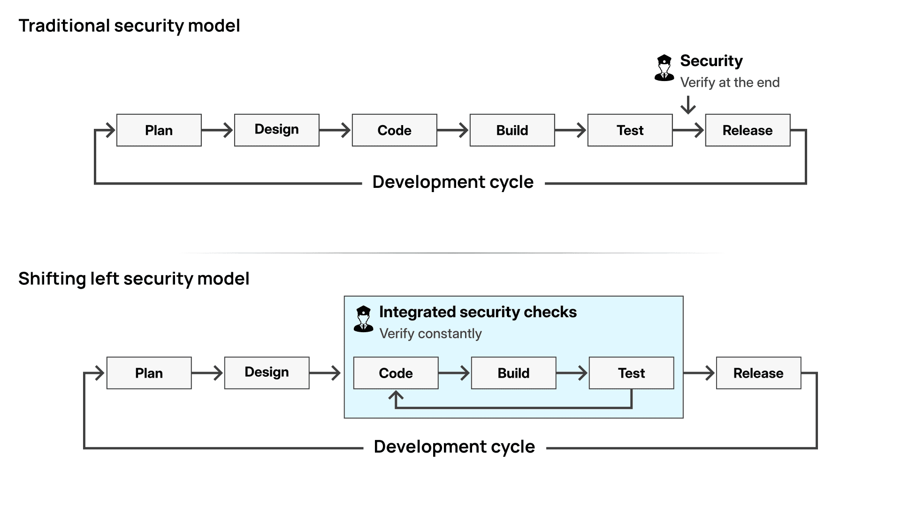
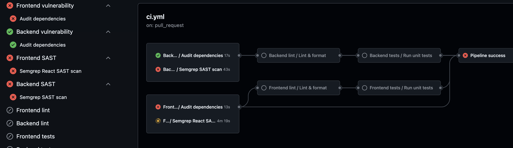

## Automated security scanning

### Introduction

In the previous subchapter, you built a pipeline that guarantees your code is formatted correctly and your logic works as expected. But what happens if your code is perfectly formatted, but fundamentally insecure?

In traditional software development, security testing often happened at the very end of the cycle, right before release. If a critical vulnerability was found, developers had to scramble to rewrite major parts of the application. Today, the industry standard is to **"Shift Left"**. This means moving security checks to the earliest possible point in the development process: the Continuous Integration pipeline.

By shifting left, you catch vulnerabilities within minutes of writing the code, long before it ever reaches a production server. In this subchapter, you will implement two important security guardrails:

- **Software Composition Analysis (SCA):** Auditing the third-party libraries you install for known vulnerabilities.
- **Static Application Security Testing (SAST):** Scanning the code you write yourself for dangerous patterns and security flaws.


_Shifting security left means finding vulnerabilities during the coding and testing phases, rather than waiting until release._

### Auditing third-party dependencies (SCA)

Modern applications are rarely built entirely from scratch. When you run `npm install` or `pip install`, you are downloading hundreds of thousands of lines of code written by other people.

Hackers know this. Instead of trying to break into your specific website, they look for vulnerabilities in popular open-source packages. If they find one, they can compromise thousands of websites at once. Software Composition Analysis (SCA) protects you from this by checking your `package.json` and `requirements.txt` against databases of known vulnerabilities (CVEs).

#### The frontend audit

For the React.js frontend, `npm` has a built-in audit command. Create a new file at `.github/workflows/frontend-vulnerability-check.yml`:

```yaml
name: Frontend vulnerability check

on:
  workflow_call:

jobs:
  vulnerability-check:
    name: Audit dependencies
    runs-on: ubuntu-latest
    defaults:
      run:
        working-directory: ./frontend
    steps:
      - name: Check out repository
        uses: actions/checkout@v6

      - name: Set up Node.js
        uses: actions/setup-node@v6
        with:
          node-version: "22"
          cache: "npm"
          cache-dependency-path: frontend/package-lock.json

      - name: Install dependencies
        run: npm ci

      - name: Run security audit
        run: npm audit
```

This workflow looks very similar to your linting workflow, but notice the `npm ci` command. This guarantees that the CI server installs the exact versions of the packages defined in your lockfile without accidentally upgrading anything. Finally, it runs `npm audit`. If any of your dependencies have a known security flaw, this command will fail and block the pipeline.

#### The backend audit

For the Node.js backend, you will use same npm audit, for Fastapi python we have a dedicated GitHub Action called `gh-action-pip-audit`. Create `.github/workflows/backend-vulnerability-check.yml`:

```yaml
name: Backend vulnerability check

on:
  workflow_call:

jobs:
  vulnerability-check:
    name: Audit dependencies
    runs-on: ubuntu-latest
    defaults:
      run:
        working-directory: ./backend
    steps:
      - name: Check out repository
        uses: actions/checkout@v6

      - name: Set up Node.js
        uses: actions/setup-node@v6
        with:
          node-version: "22"
          cache: "npm"
          cache-dependency-path: frontend/package-lock.json

      - name: Install dependencies
        run: npm ci

      - name: Run security audit
        run: npm audit
```

this is similar to frontend.

### Scanning your source code (SAST)

While auditing dependencies protects you from flaws in other people's code, Static Application Security Testing (SAST) protects you from mistakes in your own code. A SAST tool acts like an automated security auditor, reading through your source code line by line to find dangerous patterns before the application ever runs.

Semgrep is widely considered the modern standard for fast, developer-first SAST. It scans ASTs (Abstract Syntax Trees) instead of plain text, meaning it handles destructuring, async/await, and Promise chains seamlessly without generating excessive noise.

For the Node.js backend, you will use a popular modern tool called **Semgrep**. It specifically hunts for common JavaScript and Node.js security risks, such as prototype pollution, SQL injection, path traversal, hardcoded secrets, or dangerous uses of the `eval()` and `child_process.exec()` functions.

Create a new file at .github/workflows/backend-sast-check.yml:

```yaml
name: Backend SAST check

on:
  workflow_call:

jobs:
  semgrep-check:
    name: Semgrep SAST scan
    runs-on: ubuntu-latest
    defaults:
      run:
        working-directory: ./backend
    steps:
      - name: Check out repository
        uses: actions/checkout@v4

      - name: Set up Python
        uses: actions/setup-python@v5
        with:
          python-version: "3.12"

      - name: Install Semgrep
        run: pip install semgrep

      - name: Run Semgrep SAST
        run: semgrep scan --config=p/nodejs --config=p/owasp-top-ten --error
```

This workflow checks out the code, sets up Python 3.12 with `actions/setup-python@v5`, and installs Semgrep using `pip install semgrep`. Semgrep is a Python-based CLI tool (not an npm package), so we install and run it using Python.

The magic happens in the final step: `run: semgrep scan --config=p/nodejs --config=p/owasp-top-ten --error`. Here is what those flags do:

* **`semgrep scan`**: Executes the Semgrep CLI directly against your source code. By default, it recursively scans all source files in the current working directory (`./backend`).
* **`--config=p/nodejs`**: Loads Semgrep's curated Node.js ruleset to catch vulnerabilities specific to Node.js environments and popular frameworks like Express or Fastify.
* **`--config=p/owasp-top-ten`**: Loads rules covering broad web security risks based on the OWASP Top 10 vulnerabilities.
* **`--error`**: Configures Semgrep to exit with a non-zero failure code only if high-severity vulnerabilities are found. This prevents your pipeline from failing due to minor, low-risk warnings or false positives.

If Semgrep finds a serious vulnerability, it will print a detailed report in the GitHub Actions log and immediately fail the job, preventing the insecure code from reaching production.

To see this in action, try temporarily adding a deliberate security flaw to your backend. Push a commit that uses a dangerous, unsafe execution method (like adding `eval("console.log('" + req.query.input + "')");` inside one of your API routes in `app.js` or `server.js`). Push this change to a new test branch and open a pull request against your main branch:

You can use the exact same tool (Semgrep) for both backend and frontend. You just swap out the Node.js ruleset for React and client-side JavaScript rulesets.

Create a new file at .github/workflows/frontend-sast-check.yml:

```yaml
name: Frontend SAST check

on:
  workflow_call:

jobs:
  semgrep-react-check:
    name: Semgrep React SAST scan
    runs-on: ubuntu-latest
    defaults:
      run:
        working-directory: ./frontend
    steps:
      - name: Check out repository
        uses: actions/checkout@v4

      - name: Set up Python
        uses: actions/setup-python@v5
        with:
          python-version: "3.12"

      - name: Install Semgrep
        run: pip install semgrep

      - name: Run Semgrep SAST
        run: semgrep scan --config=p/react --config=p/javascript --config=p/owasp-top-ten --error
```

> [!NOTE]
> In your `frontend/` directory, create a `.semgrepignore` file containing `Dockerfile` and `nginx.conf` so Semgrep focuses purely on your React application source code and does not trigger false positives on container root execution or reverse proxy headers.


#### Key Rulesets Used:
* **`--config=p/react`**: Catches React-specific patterns like unhandled state hydration, risky DOM manipulation, and JSX XSS risks.
* **`--config=p/javascript`**: Detects dangerous JS functions like `eval()` and insecure regexes.
* **`--config=p/owasp-top-ten`**: Catches client-side OWASP risks like hardcoded credentials and open redirects.

### Updating the orchestrator

You now have four powerful security workflows ready to go. The final step is to plug them into your main CI pipeline.

Open your `.github/workflows/ci.yml` file. You are going to add the four new security jobs at the very top of your `jobs` list. Then, you are going to update the `needs` array of your existing linting jobs.

Update your file to look like this:

```yaml
# ...

jobs:
  frontend-vulnerability-check:
    name: Frontend vulnerability
    uses: ./.github/workflows/frontend-vulnerability-check.yml

  backend-vulnerability-check:
    name: Backend vulnerability
    uses: ./.github/workflows/backend-vulnerability-check.yml

  frontend-sast-check:
    name: Frontend SAST
    uses: ./.github/workflows/frontend-sast-check.yml

  backend-sast-check:
    name: Backend SAST
    uses: ./.github/workflows/backend-sast-check.yml

  frontend-lint-format-check:
    name: Frontend lint
    needs: [frontend-vulnerability-check, frontend-sast-check]
    uses: ./.github/workflows/frontend-lint-format-check.yml

  backend-lint-format-check:
    name: Backend lint
    needs: [backend-vulnerability-check, backend-sast-check]
    uses: ./.github/workflows/backend-lint-format-check.yml

# ...
```

#### The "Fail Fast" strategy

Look closely at the `needs` keywords we just updated. You explicitly told GitHub Actions that `backend-lint-format-check` cannot run until `backend-vulnerability-check` and `backend-sast-check` finish successfully.

This is known in DevOps as a **"Fail Fast"** strategy.

There is absolutely no reason to waste server computing time checking if your files have the correct indentation. By forcing the pipeline to check security first, you catch critical errors immediately and save compute time.


_The visual graph proves the Fail Fast strategy: linting and testing will not start until the security guardrails pass._

From the image above, you can see that the security jobs run first. If any of them fail, the pipeline halts immediately, and the dependent linting and testing jobs are skipped.

#### Update the gatekeeper

Finally, scroll down to the very bottom of your `ci.yml` file and update your `pipeline-success` job. You must add the four new security jobs to the `needs` array so your gatekeeper knows to monitor them:

```yaml
  pipeline-success:
    name: Pipeline success
    needs:
      [
        frontend-vulnerability-check,
        backend-vulnerability-check,
        frontend-sast-check,
        backend-sast-check,
        frontend-lint-format-check,
        backend-lint-format-check,
        frontend-unit-tests,
        backend-unit-tests,
      ]
    runs-on: ubuntu-latest
    if: always()

# ...
```

Commit and push these changes. If you open a pull request now, you will see your new security checks spin up first to protect your codebase from vulnerabilities before any other checks run.